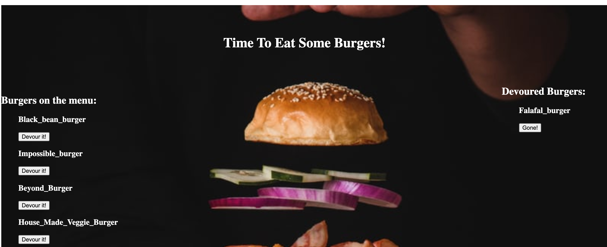

# Burger Bonanza 
========================================================

## Table of Contents

-[Introduction](#Introduction)

-[Technology](#Technologies)

-[Screenshots](#Screenshots)
   
-[Usage](#Usage)

-[Credits](#Credits)

-[Contact](#Contact)

-[License](#License) 

## Links

* [Deployed Link](https://agile-shore-76102.herokuapp.com/)

## Introduction
 Burger Bonanza is an application to prosent users with a choice of burgers already on the menu on one side of the screen, as well as an option to add a burger of their choice to the menu which they can simply type in. 

 If the application user would like to devour either a pre-listed, or burger that they created, they will hit the corresponding "devour it" button and the burger will move to the opposite side of the screen where it will be listed as having been devoured. 

## Usage 

### In order to run the application:

* Open the server.js file in integrated terminal

* Install the Express npm package: `npm install express`

* Install the Handlebars npm package: `npm install express-handlebars`

* Install MySQL npm package: `npm install mysql`

* Install Nodemon: `npm install nodemon`

* Run the command: `node index.js` in the integrated terminal. 

### Screen Shots

## Technologies

Technology used to create application

* Mysql

* Express-Handlebars

* Inquirer

* Nodejs

* Express

* Jquery

	

## Project Challenges
*   

## Credits

* [Stack Overflow general research](https://stackoverflow.com/) 
* [Mdn web docs general research](https://developer.mozilla.org/en-US/)
* [AskBCS bug fixes]
* [Npm Express Handlebars Docs](https://www.npmjs.com/package/express-handlebars)
* [Traversy Media NodeJS Express and Handlebars Youtube tutorial](https://www.youtube.com/watch?v=SfQFoMOd_ng)

## Author
 Meredith Jones

## Contact
 [@MeredithJones](https://github.com/meredithajones)

## License 
This project is licensed under the terms of the MIT license.
